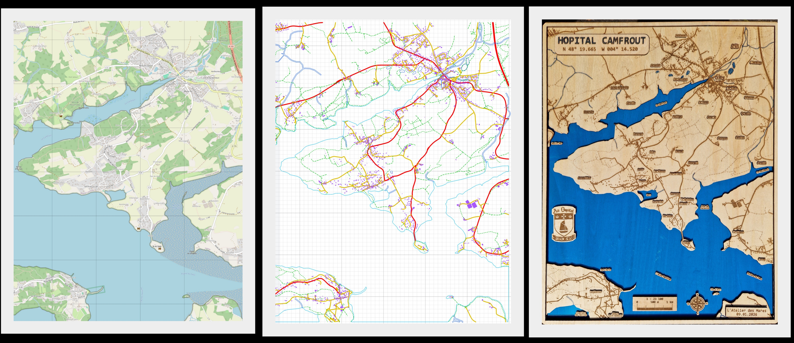
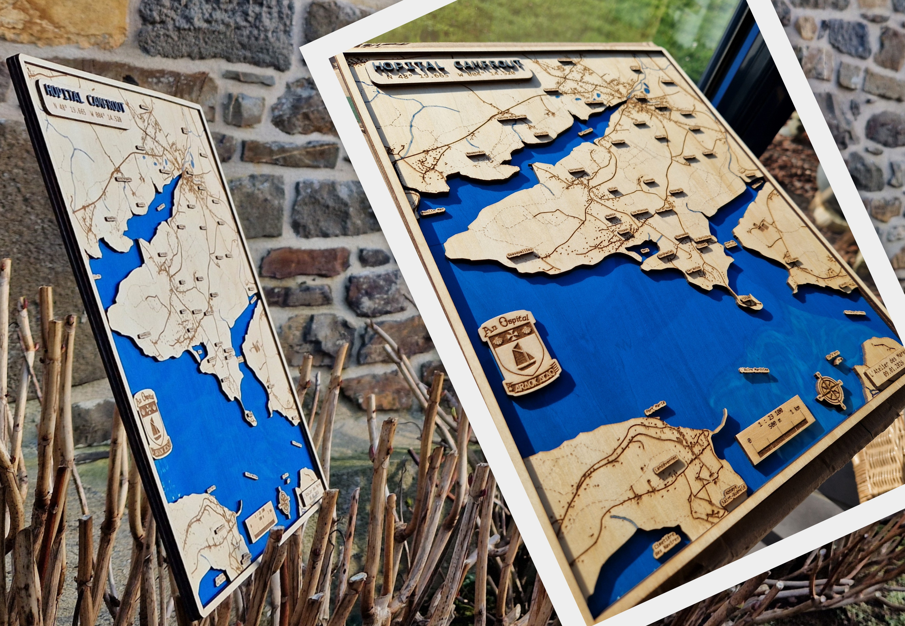
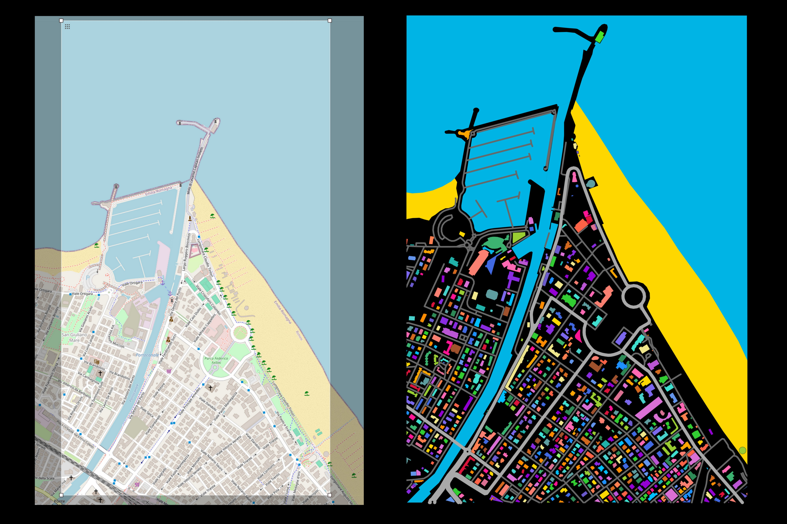
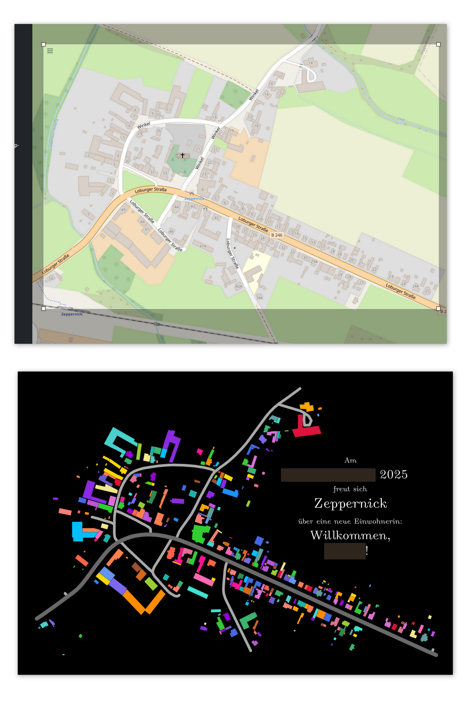
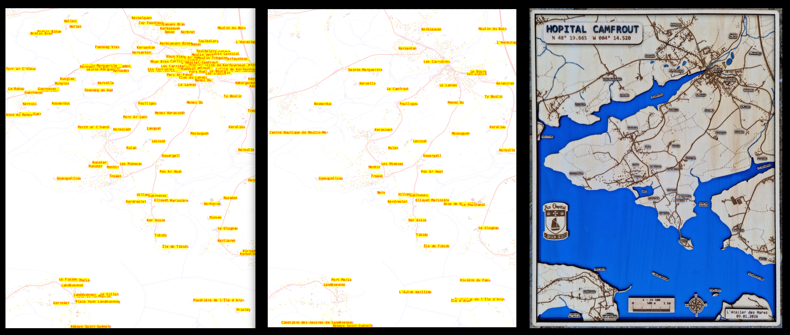

## About

This repository helps create **your own artwork based on real geographic maps**.

In short:
> A python script converts a `.osm` file exported from **[`openstreetmap.org`](https://openstreetmap.org)** is converted to a `.svg` file.

## Applications: custom maps

### 3d laser cut engraved wood maps

The created .svg file is importable to **laser cutter and engraver machines** such as `xTools`.

|  | 
|:--------------------------:| 
| *Laser cut engraved map.*  |

|  | 
|:--------------------------:| 
| *Laser cut engraved map.*  |

### Flat artworks

Each building gets randomly assigned a colour, based on a set of colours defined in [`config.yaml`](config.yaml).

|                                        | 
|:------------------------------------------------------------:| 
| *The generated image is then printed on a alu dibond frame.* |


|                            | 
|:---------------------------------------------:| 
| *The generated image is printed as a poster.* |


### 3d printing

`osm_art` can probably be used for 3d printing as well: the different layers (`building`, `road`, `sea`, ...) can be assigned a height, e.g. using blender.

## Step-by-step usage

go to https://www.openstreetmap.org/#map=15/48.32029/-4.25231

move and zoom to your zone of interest

select `Export` mode

click `Manually select a different area` and draw a box around your zone of interest

click `Export` to download (`map.osm`)

copy the coordinates of the selected area. For instance, highlight with the mouse and copy-paste:
```
48.35303
-4.26463
-4.21785
48.28679
```

place the downloaded `map.osm` to `ignored/osm/map.osm`.

rename if needed. I will rename it to `my_map.osm` for the example.

in [`config.yaml`](config.yaml), set under `projects` the name of your osm file and the coordinates of the selected area:
- `nwes` means "north-west-east-south", and should already be the correct order of the above highlighted-and-copy-pasted text:

```yaml
projects:
  my_map:
    nwes: [48.35303, -4.26463, -4.21785, 48.28679]
    height_cm: 24
```

decide the size in cm of the width or the heigh. Do set only one of them! Considering the capability of your machine.
- For instance `height_cm: 24`

run `python convert_osm_to_svg.py [PROJECT_NAME]` where `[PROJECT_NAME]` is the name of your project (`my_map` in my example).

the script will create a `ignored/res/my_map` directory, with a svg (`my_map.svg`).

you can visualise it your favourite program (e.g. web-browser or inkscape).
- You can also manually edit the .svg, for instance using `inkscape`, to remove some elements that would be complicated to process for the wood-carving machine.
- The goal of the python script is to avoid tedious manual editing as much as possible. But some adjustments may still be required.

the svg can be imported to `xTool Studio`.
- If asked `The image is larger than the canvas. Scale down?` answer `No, keep originial size`.
- The svg map may be outside the canvas. Just translate it to bring on the canvas. But no scaling is needed.
- In `Layer and object list` you can define the settings (`Engrave` / `Cut`) for each layer.


## Installation

1. **Clone the repository**

```bash
git clone https://github.com/chauvinSimon/osm_art.git
cd osm_art
```

2. Install using [`uv`](https://docs.astral.sh/uv/getting-started/)

```bash
uv sync
source .ven/bin/activate
```

3. Verify installation

```bash
python -m unittest discover -s tests -p "*.py"
```

4. Try main script
```bash
python convert_osm_to_svg.py --help
```


## FAQ

> How to set the **width** of the elements like **roads and rivers**?
- in [`config.yaml`](config.yaml) use `osm/layer_config` section: set the `stroke_width` parameter.
- The unit is mm.

---

> Can I engrave a correctly-scaled **map-scale**? 📏
- Yes, in the created `ignored/res/my_map` directory a `my_map_scale_bar.svg` is produced when running `convert_osm_to_svg.py`.
- This .svg can directly be imported to `xTool Studio`.
- The scaling dimensions are printed when running `convert_osm_to_svg.py`. For instance:

```
INFO:utils_osm:Original dimensions: 5,208m x 11,089m
INFO:utils_osm:Scaled dimensions: 113mm x 240mm
INFO:utils_osm:Scale factor: 1:46203
INFO:utils_osm:Scale: 1cm on map = 462.0m in reality
INFO:utils_osm:Scale: 1km in reality = 2.164cm on map
```

---

> Can I retrieve the **names** present in the exported map?
- Yes. One application is to create wood tiles with names on it and paste them on the map.
- First run `python convert_osm_to_svg.py [PROJECT_NAME]` with the `--save_name_maps` flag
  - In the `ignored/res/my_map` directory it will save single map for each name (in `individual_maps`).
  - The name categories to retrieve can be set in [`config.yaml`](config.yaml) under `name_categories`.
  - Note: there may be duplicated names.
  - Note: for large map areas or dense maps, there may be many names retrieved.
- Then go to `ignored/res/my_map` directory and edit `name_positions.yaml`
  - Delete all names you do not want to keep.
- Finally run `python apply_name_selection.py [PROJECT_NAME]`
  - It will consider all names present in `name_positions.yaml`, add them to `selected_names.txt`
  - You can visualise their positions in `map_selected_names.svg`


|                                                                                                   | 
|:------------------------------------------------------------------------------------------------------------------------------:| 
| *Left: all names are automatically retrieved. Middle: after selection. Right: the selected names are engraved on wood labels.* |

---

> What **area size** is appropriate?
- Wood carving works best with small (~10 km² or less).
- Especially nice for seashore.


# Edit the .svg in inkscape

> How to create the sea?
- When you import an .svg from OSM, many “lines” are actually polylines or grouped objects, which `Node` tool cannot edit until they are proper paths.
- With the line selected, go to `Path → Object to Path` (Shift+Ctrl+C).
- Switch to the `Node` tool (`N`).
- Click the line.
- You should now see small square nodes along the path.

> How to close the path into a polygon for filling?
- With the Node tool:
- select both the start and end nodes (click while holding Shift).
- Press Shift+J → Join Selected Nodes.

> How to split a path?
- Select the start node and the next node in the path (Shift+Click).
- In the Node tool toolbar, click “Break segment between two nodes” (icon looks like a small line breaking apart).
- Shortcut: Shift+B.
- This will open the path at that segment.

> How to save a good-quality png?
- The best is probably to open in inkscape and export to png setting the DPI.
- Do binary search to determine the max resolution accepted by [DM Fotoparadies](https://www.fotoparadies.de/).
- The limit is not strictly related to the file size: sometimes accepting 5MB, sometimes limited at 2.5MB.

> How to add text?
- Press `T`.
- Not all fonts offer "bold" and "italic"

> How to adjust the page size?
- Click on page icon (Document Properties).
- Adjust page dimension with `Width` and `Height`.
- Adjust top-left corner under `Viewbox`.

Warning about sea: "sea-only" zones are cropped, whatever selection is done in https://www.openstreetmap.org/export.

# Map data

[OSM Copyright and License](https://www.openstreetmap.org/copyright)